<div align="center">

# 🏠 Predicción de Precios de Casas con Machine Learning


### 📊*Análisis predictivo del mercado inmobiliario chileno mediante algoritmos avanzados*

**💡Descripción del Proyecto**

Este proyecto de Data Science se enfoca en la predicción precisa de precios de casas en venta mediante la integración de múltiples fuentes de datos. Utiliza Web Scraping para extraer ofertas de venta de casas de tres portales inmobiliarios, combinando y unificando estos datos con fuentes gubernamentales. El objetivo es entrenar, comparar y optimizar modelos como Random Forest, LightGBM, XGBoost, SVM, Regresión lineal y MLP aplicando Cross-Validation por K-Folders y optimización de hiperparámetros con optuna para ofrecer una tasación robusta y fiable de propiedades.

<p align="center">
   
</p>

---

## 🎯1. Objetivo del Proyecto

El objetivo principal es determinar el modelo de machine learning con mejor desempeño para el pronóstico de precios mediante un análisis comparativo principal abordado es identificar, mediante una comparación y evaluación, rigurosa y sistemática de algoritmos de machine learning, cuál de ellos ofrece el mejor desempeño predictivo al trabajar en el contexto de datos de precios de lista del mercado chileno de viviendas.

---

## 📦2. Requisitos del Proyecto

Este proyecto requiere que el ambiente tenga instaladas las siguientes tecnologías y bibliotecas de Python:

### 🛠️ Tecnologías y Librerías

**Lenguaje:** Python versión 3.8 o superior

**Web Scraping:** `📡requests`, `🥣BeautifulSoup`, `🤖Selenium`

**Manejo de Datos:** `🐼pandas`, `🔢numpy`.

**Machine Learning:** `🧪scikit-learn`, `⚡XGBoost`, `💡lightgbm`.

**Deep Learning:**  `🦾pytorch`, `🎯optuna`.

**Visualización:** `📉matplotlib`, `🌊seaborn`.

</div>

<div align="center">

## 📁3. Estructura del Proyecto

</div>

```
Proyecto_Tesis_HP/
│
├── 📂 data/                          # Datos del proyecto
│   │
│   ├── 📂 external/                  # Datos externos de fuentes gubernamentales
│   │   ├── 📂 casen/                 # Bases de datos Encuesta CASEN 2022
│   │   │   ├── Base de datos Casen 2022 STATA.dta
│   │   │   └── Base de datos provincia y comuna STATA.dta
│   │   ├── 📂 scraped/               # Datos scrapeados
│   │   │   └── datos_comunas_extraidos.cs  # Variables comunales BCN
│   │   └── 📂 shapefiles/            # Archivos geoespaciales (.shp)
│   │       ├── archivoscomunaschile/ # Polígonos de comunas de Chile
│   │       ├── Estaciones_actuales_Metro_de_Santiago
│   │       └── layer_establecimientos_de_salud
│   │
│   ├── 📂 interim/                   # Datos intermedios procesados
│   │   ├── caracteristicas_vivienda_rm_casen2022.csv
│   │   ├── coordenadas_estaciones_metro.csv
│   │   ├── coordenadas_hospitales_publicos_rm.csv
│   │   ├── datos_scraping_unificados.csv
│   │   ├── datos_variables_completas.csv
│   │   └── propiedades_con_comuna.csv
│   │
│   ├── 📂 processed/                 # Dataset final limpio para modelado
│   │   ├── data_final.csv            # Dataset limpio (4,508 registros)
│   │   └── dataset_variables_finales.csv
│   │
│   └── 📂 rawdata/                   # Datos crudos sin procesar
│       ├── pag1.csv                  # Scraping Portal 1
│       ├── pag2.csv                  # Scraping Portal 2
│       └── pag3.csv                  # Scraping Portal 3
│
├── 📂 docs/                          # Documentación
│   └── 📂 images/                    # Imágenes del README
│       ├── 1FuentesdeDatos.png
│       ├── 2Unificacion.png
│       ├── 3VariablesIniciales.png
│       └── ... (21+ imágenes del pipeline)
│
├── 📂 notebooks/                     # Jupyter Notebooks del análisis
│   │
│   ├── 📂 0.unificacion_datos/
│   │   └── 0.unificar_data_sets.ipynb
│   │
│   ├── 📂 1.preparacion_de_variables/
│   │   ├── 1.1.ConversionCoordenadasRM.ipynb
│   │   ├── 1.2.CoordenadasHospitalesChile.ipynb
│   │   ├── 1.3.CoordenadasMetrosChile.ipynb
│   │   ├── 1.4.ScrapingInfoComunas.ipynb
│   │   └── 1.5.ConversionEncuestaCasen.ipynb
│   │
│   ├── 📂 2.procesado_datos/
│   │   └── 2.1.procesado_dataset_completo.ipynb
│   │
│   ├── 📂 3.limpieza_datos/
│   │   └── 3.1.limpieza_datos.ipynb
│   │
│   ├── 📂 4.training_feature_importance/
│   │   └── 4.1.RFXGBLGBMTraining.ipynb
│   │
│   ├── 📂 5.EDA/
│   │   └── 5.1.EDA_variables_importantes.ipynb
│   │
│   └── 📂 6.training/
│       ├── 6.1.NNMLPTrain.ipynb
│       └── 6.2.RSVMTrain.ipynb
│
└── 📄 README.md                      # Documentación del proyecto
```

<div align="center">

## 🧠 4. Metodología y Modelos

### 📊 4.1 Recolección de Datos

#### 🕷️ Web Scraping de Portales Inmobiliarios
Se utilizaron 3 scripts de Python para extraer datos de diferentes portales:

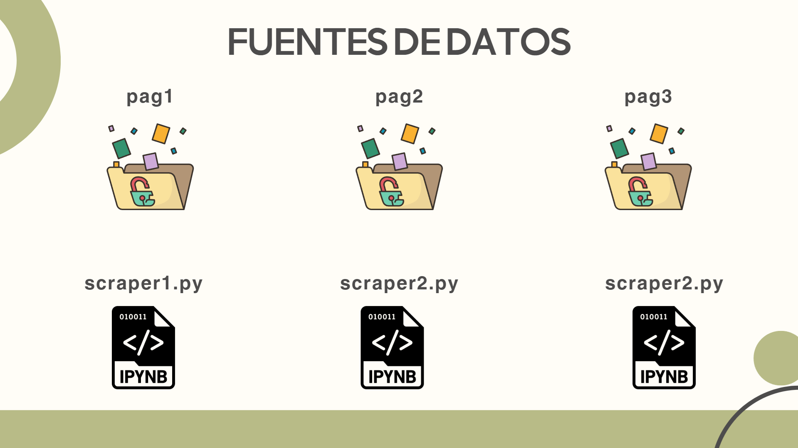

**Variables base extraídas:** Precio 💰 | Baños 🚿 | Dormitorios 🛏️ | Superficie Total 📏 | Superficie Construida 🏗️ | Estacionamientos 🚗 | Latitud 📍 | Longitud 🗺️

---

### 🔄 4.2 Procesamiento y Unificación

#### Estandarización de Datasets
Los tres datasets fueron estandarizados y unificados en una única base de datos:

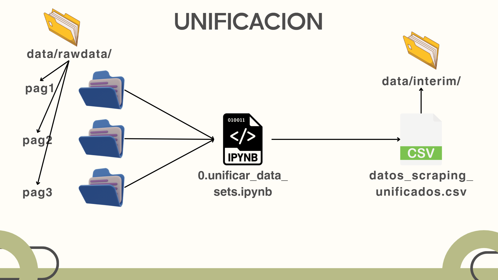

#### 🏛️ Comunas
**Fuente:** BCN Chile

Luego se utilizo un archivo shapely descargado de la [Biblioteca del Congreso Nacional](https://www.bcn.cl/siit/mapas_vectoriales) para tener los hexagonos de las comunas de todo Chile, para luego ver a que comuna pertenecen las coordenadas de cada casa y agregarla al dataset.

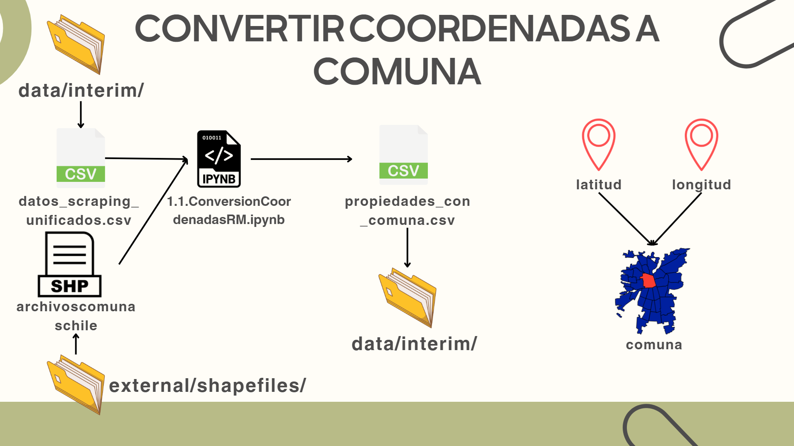

#### 🏥 Hospitales
**Fuente:** [GeoPortal](https://www.geoportal.cl/geoportal/catalog/36767/Establecimientos%20de%20salud%20de%20Chile%20Agosto%202025)

Para obtener la ubicacion de los hospitales, se utilizo un archivo shapely extraido de [GeoPortal](https://www.geoportal.cl/geoportal/catalog/36767/Establecimientos%20de%20salud%20de%20Chile%20Agosto%202025), el cual nos da un archivo con todos los establecimientos de salud de Chile, además de el archivo shapely de las comunas de Chile.

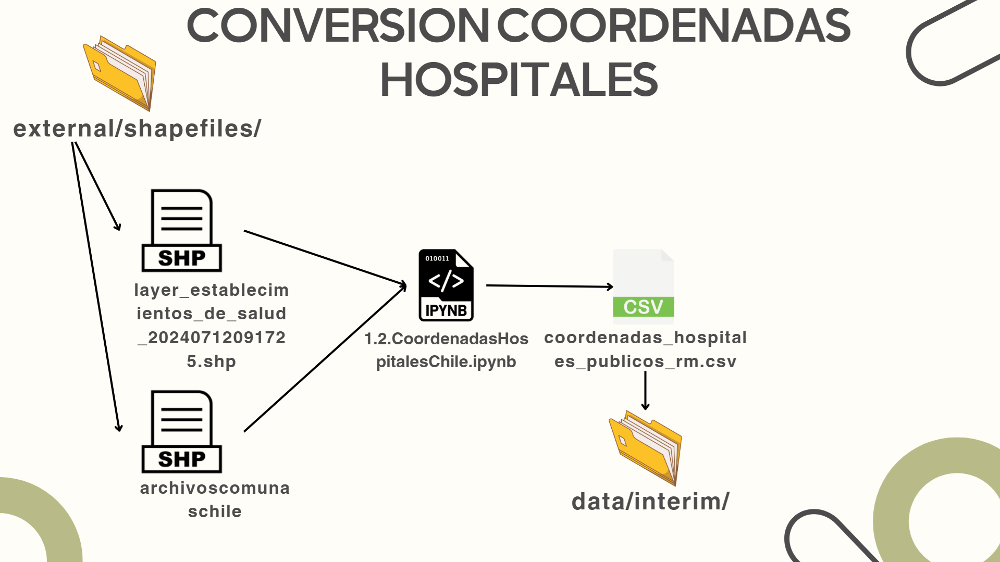

Este es el ejemplo de las ubicaciones extraídas de los hospitales

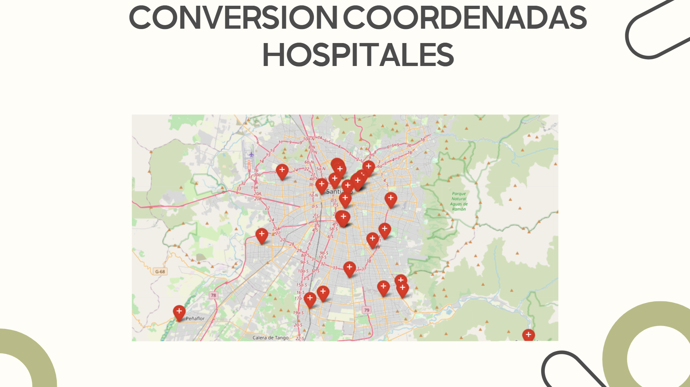

#### 🚇 Metro
**Fuente:** [ArcGIS](https://ideocuc-ocuc.hub.arcgis.com/datasets/a728b2ad4b6d41359a1d4514ece5f05f_0/explore)

Para las estaciones del metro se hizo algo similar que en los hospitales, la diferencia es que el archivo shapely de las estaciones de metro fue extraido de [arcGIS](https://ideocuc-ocuc.hub.arcgis.com/datasets/a728b2ad4b6d41359a1d4514ece5f05f_0/explore).

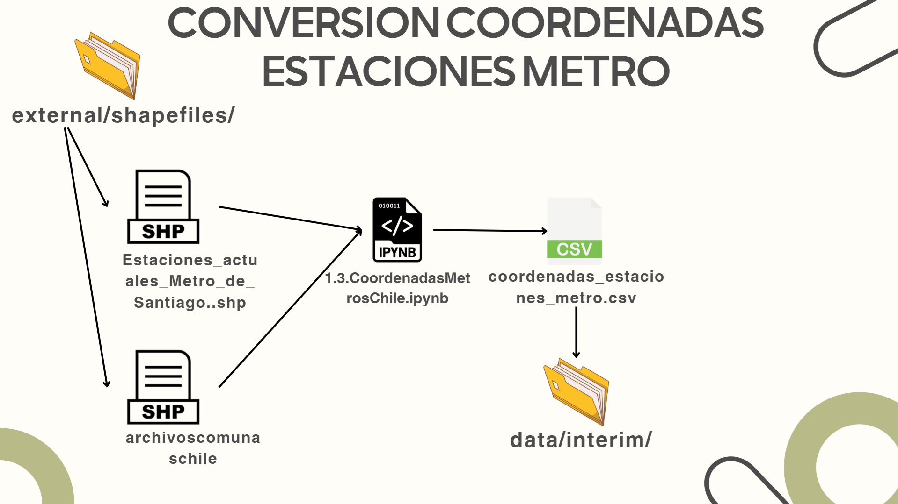

</td>
</tr>
</table>

Este es el ejemplo de las estaciones de metro extraídas de la región metropolitana.

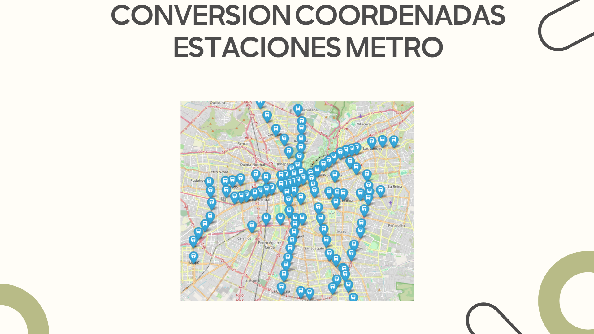

---

### 📈 4.3 Feature Engineering

#### 🏙️ Variables Socioeconómicas Comunales
**Fuente:** [Biblioteca del Congreso Nacional](https://www.bcn.cl/siit/mapoteca/comunas)

Para agregarle más cantidad de variables al modelo e ir enriqueciendo el poder predictivo de los modelos, se extrajeron 134 variables asociadas a cada comuna de la página de la [Biblioteca del Congreso Nacional](https://www.bcn.cl/siit/mapoteca/comunas)

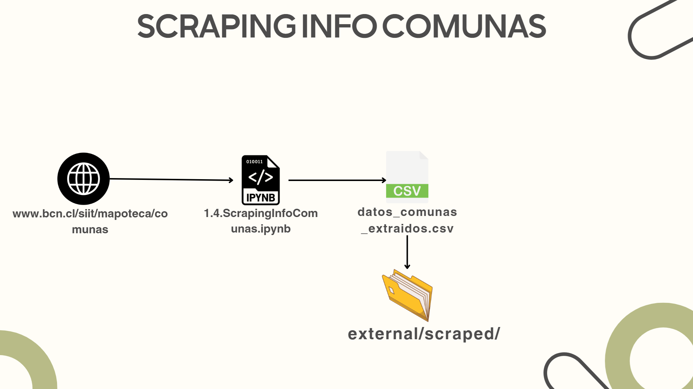

<div align="center">

| 📊 Categoría | Variables | Descripción |
|:-------------|:---------:|-------------|
| 👥 **Demografía y Población** | 10 | Distribución poblacional, grupos etarios, índices demográficos |
| 💰 **Pobreza y Condiciones Sociales** | 4 | Indicadores de pobreza y calidad de vida |
| 🏥 **Salud** | 42 | Establecimientos de salud e indicadores sanitarios |
| 📚 **Educación** | 16 | Matrícula educacional y rendimiento SIMCE |
| 💼 **Empresas y Empleo** | 58 | Empresas y trabajadores por tamaño y sector económico |
| 🏛️ **Municipio y Seguridad** | 3 | Presupuesto municipal y criminalidad |
| 🌱 **Otros Indicadores** | 1 | Índice de adulto mayor, fecundidad |

**Total: 134 variables comunales**

</div>

---

<details>
<summary>👥 <b>Demografía y Población (10 variables)</b> - Click para expandir</summary>

1. `población 2024` - Población total de la comuna
2. `índice masculinidad 2024` - Relación hombres/mujeres
3. `grupo_etario_0_a_14_2024_(%)` - Porcentaje población infantil
4. `grupo_etario_15_a_29_2024_(%)` - Porcentaje población joven
5. `grupo_etario_30_a_44_2024_(%)` - Porcentaje población adulta joven
6. `grupo_etario_45_a_64_2024_(%)` - Porcentaje población adulta
7. `grupo_etario_65_o_mas_2024_(%)` - Porcentaje adultos mayores
8. `idd 2024` - Índice de Dependencia Demográfica
9. `iam 2024` - Índice de Adulto Mayor
10. `pueblos indígenas 2025 (%)` - Porcentaje población indígena
11. `extranjeros 2025 (%)` - Porcentaje población extranjera

</details>

<details>
<summary>💰 <b>Pobreza y Condiciones Sociales (4 variables)</b> - Click para expandir</summary>

1. `pobreza por ingresos 2022 (%)` - Porcentaje hogares en pobreza por ingresos
2. `pobreza multidimensional 2022 (%)` - Porcentaje hogares con carencias múltiples
3. `carentes servicios básicos 2025 (%)` - Hogares sin acceso a servicios básicos
4. `hogares hacinados 2025 (%)` - Porcentaje de hogares con hacinamiento

</details>

<details>
<summary>🏥 <b>Salud (42 variables)</b> - Click para expandir</summary>

**Establecimientos de Salud (38 tipos):**
1. `cantidad de: atención remota 2025`
2. `cantidad de: centro comunitario de salud familiar (cecosf) 2025`
3. `cantidad de: centro comunitario de salud mental (cosam) 2025`
4. `cantidad de: centro corporación para la nutrición infantil (conin) 2025`
5. `cantidad de: centro de apoyo comunitario para personas con demencia 2025`
6. `cantidad de: centro diagnóstico terapéutico y tratamiento privado (cdt) 2025`
7. `cantidad de: centro de diálisis 2025`
8. `cantidad de: centro de especialidad 2025`
9. `cantidad de: centro de referencia de salud (crs) 2025`
10. `cantidad de: centro de regulación médica de las urgencias (samu) 2025`
11. `cantidad de: centro de rehabilitación 2025`
12. `cantidad de: centro de salud de atención cerrada para personas privadas de libertad 2025`
13. `cantidad de: centro de salud familiar (cesfam) 2025`
14. `cantidad de: centro de salud mental 2025`
15. `cantidad de: centro de salud privado 2025`
16. `cantidad de: centro de salud público 2025`
17. `cantidad de: centro de tratamiento de adicciones (cta) 2025`
18. `cantidad de: clínica 2025`
19. `cantidad de: clínica dental 2025`
20. `cantidad de: clínica dental móvil 2025`
21. `cantidad de: consultorio general rural (cgr) 2025`
22. `cantidad de: consultorio general urbano (cgu) 2025`
23. `cantidad de: dirección servicio de salud 2025`
24. `cantidad de: dispositivo incorporado por crisis sanitaria 2025`
25. `cantidad de: estación médica rural (emr) 2025`
26. `cantidad de: hospital 2025`
27. `cantidad de: hospital de dia adulto 2025`
28. `cantidad de: hospital de día infanto adolescente 2025`
29. `cantidad de: laboratorio clínico 2025`
30. `cantidad de: oficina sanitaria 2025`
31. `cantidad de: policlínico funcionarios (minería) 2025`
32. `cantidad de: posta de salud rural (psr) 2025`
33. `cantidad de: programa de reparación y atención integral de salud (prais) 2025`
34. `cantidad de: puesto de atención médica especializado (pame) incorporado por crisis sanitaria 2025`
35. `cantidad de: sala externa de toma de muestras (setm) 2025`
36. `cantidad de: salud ambiental 2025`
37. `cantidad de: servicio de atención primaria de urgencia (sapu) 2025`
38. `cantidad de: servicio de atención primaria de urgencia de alta resolutividad (sar) 2025`
39. `cantidad de: servicio de urgencia rural (sur) 2025`
40. `cantidad de: unidad de atención primaria oftalmológica (uapo) 2025`
41. `cantidad de: unidad de procedimientos móvil 2025`
42. `cantidad de: unidad de salud funcionarios 2025`
43. `cantidad de: vacunatorio 2025`

**Indicadores de Salud (4):**
1. `fecundidad 2022` - Tasa de fecundidad
2. `natalidad 2022` - Tasa de natalidad
3. `mortalidad general 2022 (c/1.000 hab)` - Tasa de mortalidad general
4. `mortalidad infantil 2022 (c/1.000 nac.vivos)` - Tasa de mortalidad infantil

</details>

<details>
<summary>📚 <b>Educación (16 variables)</b> - Click para expandir</summary>

**Por tipo de establecimiento:**
1. `matrícula municipal 2024` - Matrícula en colegios municipales
2. `matrícula subvencionada 2024` - Matrícula en colegios subvencionados
3. `matrícula particular pagado 2024` - Matrícula en colegios particulares
4. `matrícula corporación admin delegada 2024` - Matrícula en corporaciones
5. `matrícula servicio local educación 2024` - Matrícula en servicios locales

**Por nivel educativo:**
6. `matrícula_educación_parvularia_2024` - Educación preescolar
7. `matrícula_enseñanza_básica_niños_2024` - Educación básica regular
8. `matrícula_educación_básica_adultos_2024` - Educación básica adultos
9. `matrícula_educación_especial_2024` - Educación especial
10. `matrícula_enseñanza_media_humanístico-científica_jóvenes_2024` - Media HC jóvenes
11. `matrícula_educación_media_humanístico-científica_adultos_2024` - Media HC adultos
12. `matrícula_enseñanza_media_técnico_profesional_y_artística_jóvenes_2024` - Media TP jóvenes
13. `matrícula_educación_media_técnico_profesional_y_artística_adultos_2024` - Media TP adultos

**Rendimiento académico:**
14. `simce 4to básico lectura 2022` - Puntaje SIMCE lectura
15. `simce 4to básico matemáticas 2022` - Puntaje SIMCE matemáticas

</details>

<details>
<summary>💼 <b>Empresas y Empleo (58 variables)</b> - Click para expandir</summary>

**Empresas por tamaño (5):**
1. `empresas_micro_2023` - Microempresas (1-9 trabajadores)
2. `empresas_pequeña_2023` - Pequeñas empresas (10-49 trabajadores)
3. `empresas_mediana_2023` - Medianas empresas (50-199 trabajadores)
4. `empresas_grande_2023` - Grandes empresas (200+ trabajadores)
5. `empresas_sin_ventas_sin_información_2023` - Empresas sin datos

**Trabajadores por tamaño de empresa (5):**
6. `trabajadores_micro_2023`
7. `trabajadores_pequeña_2023`
8. `trabajadores_mediana_2023`
9. `trabajadores_grande_2023`
10. `trabajadores_sin_ventas_sin_información_2023`

**Empresas por sector económico (20):**
11. `empresas_agricultura_ganadería_2023`
12. `empresas_minería_2023`
13. `empresas_industria_manufacturera_2023`
14. `empresas_suministro_electricidad_2023`
15. `empresas_suministro_agua_2023`
16. `empresas_construcción_2023`
17. `empresas_comercio_2023`
18. `empresas_transporte_2023`
19. `empresas_alojamiento_comidas_2023`
20. `empresas_información_comunicaciones_2023`
21. `empresas_financieras_seguros_2023`
22. `empresas_inmobiliarias_2023`
23. `empresas_profesionales_científicas_2023`
24. `empresas_servicios_administrativos_2023`
25. `empresas_administración_pública_2023`
26. `empresas_enseñanza_2023`
27. `empresas_salud_2023`
28. `empresas_artísticas_entretenimiento_2023`
29. `empresas_otras_actividades_2023`
30. `empresas_hogares_empleadores_2023`
31. `empresas_organizaciones_extraterritoriales_2023`
32. `empresas_sin_información_2023`

**Trabajadores por sector económico (20):**
33. `trabajadores_agricultura_ganadería_2023`
34. `trabajadores_minería_2023`
35. `trabajadores_industria_manufacturera_2023`
36. `trabajadores_suministro_electricidad_2023`
37. `trabajadores_suministro_agua_2023`
38. `trabajadores_construcción_2023`
39. `trabajadores_comercio_2023`
40. `trabajadores_transporte_2023`
41. `trabajadores_alojamiento_comidas_2023`
42. `trabajadores_información_comunicaciones_2023`
43. `trabajadores_financieras_seguros_2023`
44. `trabajadores_inmobiliarias_2023`
45. `trabajadores_profesionales_científicas_2023`
46. `trabajadores_servicios_administrativos_2023`
47. `trabajadores_administración_pública_2023`
48. `trabajadores_enseñanza_2023`
49. `trabajadores_salud_2023`
50. `trabajadores_artísticas_entretenimiento_2023`
51. `trabajadores_otras_actividades_2023`
52. `trabajadores_hogares_empleadores_2023`
53. `trabajadores_organizaciones_extraterritoriales_2023`
54. `trabajadores_sin_información_2023`

</details>

<details>
<summary>🏛️ <b>Municipio y Seguridad (3 variables)</b> - Click para expandir</summary>

1. `disponibilidad_presupuestaria_por_habitante_2023_(m$)` - Presupuesto municipal per cápita
2. `delitos mayor connotación social 2023 (c/100.000 hab)` - Tasa de delitos graves
3. `violencia intrafamiliar 2023 (c/100.000 hab)` - Tasa de VIF

</details>

---

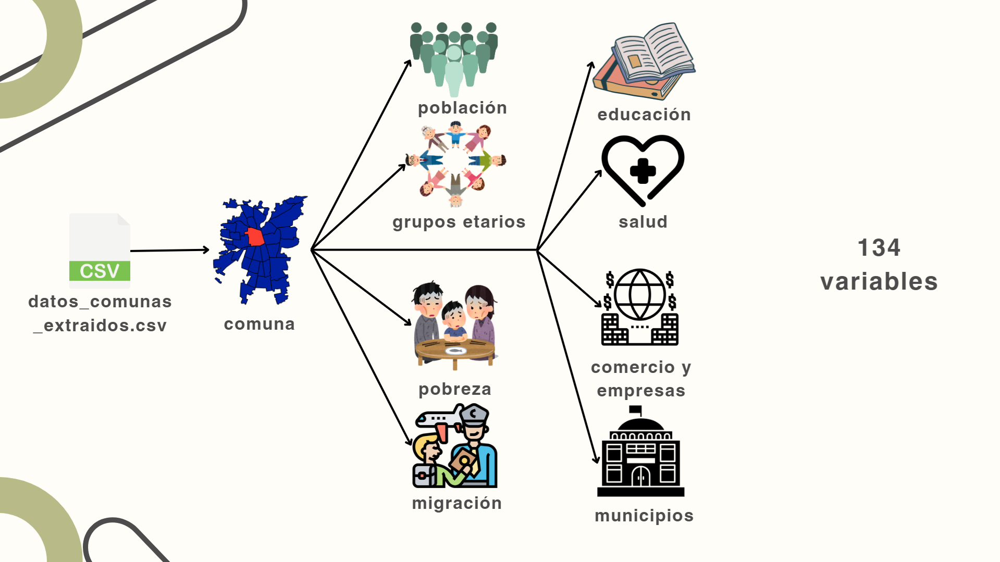

#### 🏠 Variables de Calidad de Vivienda (CASEN)
**Fuente:** [Encuesta CASEN 2022](https://observatorio.ministeriodesarrollosocial.gob.cl/encuesta-casen-2022)

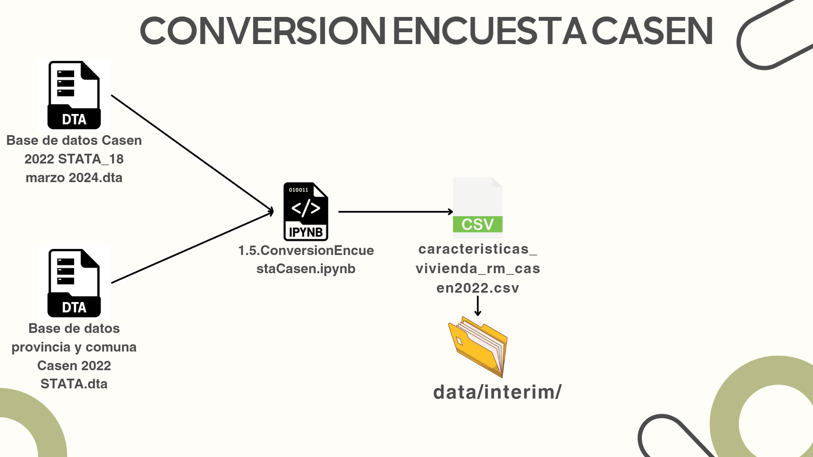

Se obtuvieron 18 variables relacionadas con características de calidad y condiciones habitacionales a nivel comunal, extraídas de la [Encuesta Casen](https://observatorio.ministeriodesarrollosocial.gob.cl/encuesta-casen-2022) , son 2 bases de datos las cuales se tuvieron que cruzar.

<div align="center">

| 📊 Categoría | Variables | Descripción |
|:-------------|:---------:|-------------|
| 🏘️ **Tipo de Vivienda** | 4 | Distribución porcentual por tipo de construcción |
| 🏗️ **Calidad de Materiales** | 4 | Indicadores de solidez estructural |
| 💧 **Servicios e Instalaciones** | 3 | Calidad de servicios básicos y cocina |
| 🔑 **Tenencia** | 2 | Tipo de propiedad de la vivienda |
| 💰 **Ingresos** | 2 | Indicadores económicos del hogar |
| 📈 **Índices Compuestos** | 3 | Métricas agregadas de calidad habitacional |

**Total: 18 variables CASEN**

</div>

---

<details>
<summary>🏘️ <b>Tipo de Vivienda (4 variables)</b> - Click para expandir</summary>

1. `pct_casa` - Porcentaje de viviendas tipo casa
2. `pct_departamento` - Porcentaje de departamentos
3. `pct_casa_depto` - Porcentaje de casas/deptos convencionales
4. `pct_vivienda_precaria` - Porcentaje de viviendas precarias (mediagua, mejora, rancho)

</details>

<details>
<summary>🏗️ <b>Calidad de Materiales (4 variables)</b> - Click para expandir</summary>

1. `pct_paredes_solidas` - Porcentaje de viviendas con paredes sólidas (hormigón, ladrillo, piedra)
2. `pct_techo_solido` - Porcentaje de viviendas con techo sólido (tejas, zinc, losa hormigón)
3. `pct_piso_bueno` - Porcentaje de viviendas con piso de buena calidad (parquet, cerámica, flexit)
4. `indice_calidad_materiales` - **Índice compuesto** de calidad estructural

</details>

<details>
<summary>💧 <b>Servicios e Instalaciones (3 variables)</b> - Click para expandir</summary>

1. `pct_agua_red_publica` - Porcentaje de viviendas con agua potable de red pública
2. `pct_wc_bueno` - Porcentaje con WC conectado a alcantarillado o fosa séptica
3. `pct_cocina_moderna` - Porcentaje con cocina de gas, eléctrica o encimera

</details>

<details>
<summary>🔑 <b>Tenencia de Vivienda (2 variables)</b> - Click para expandir</summary>

1. `pct_propia_total` - Porcentaje de viviendas propias (pagadas o pagándose)
2. `pct_arrendada` - Porcentaje de viviendas arrendadas

</details>

<details>
<summary>💰 <b>Ingresos del Hogar (2 variables)</b> - Click para expandir</summary>

1. `ingreso_promedio` - Ingreso promedio mensual del hogar (CLP)
2. `ingreso_mediana` - Ingreso mediano mensual del hogar (CLP)

</details>

<details>
<summary>📈 <b>Índices Compuestos de Calidad (3 variables)</b> - Click para expandir</summary>

1. `indice_calidad_materiales` - Índice agregado de calidad de materiales de construcción
2. `indice_servicios_basicos` - Índice agregado de acceso a servicios básicos
3. `indice_calidad_vivienda_general` - **Índice general** que combina materiales, servicios e instalaciones

</details>

---

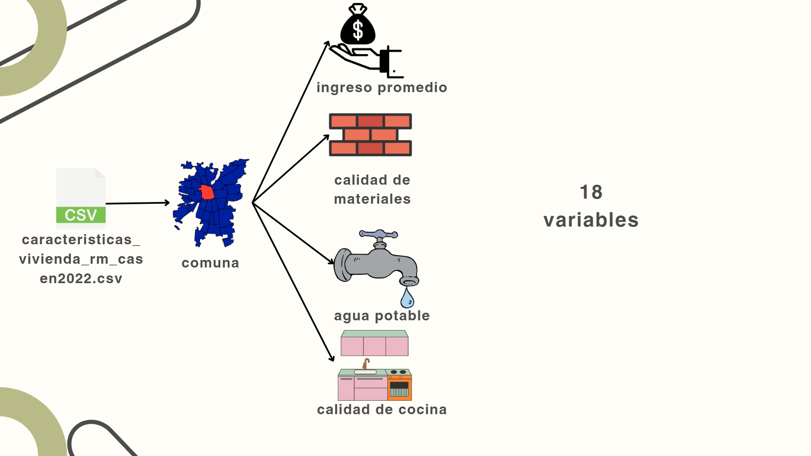

---

### 🔗 4.4 Unificación Final del Dataset

Luego de obtener todos estos datos de las diferentes fuentes, se procedió a realizar la **unificación e integración** de todas las variables para crear el dataset completo que alimentará los modelos de Machine Learning.

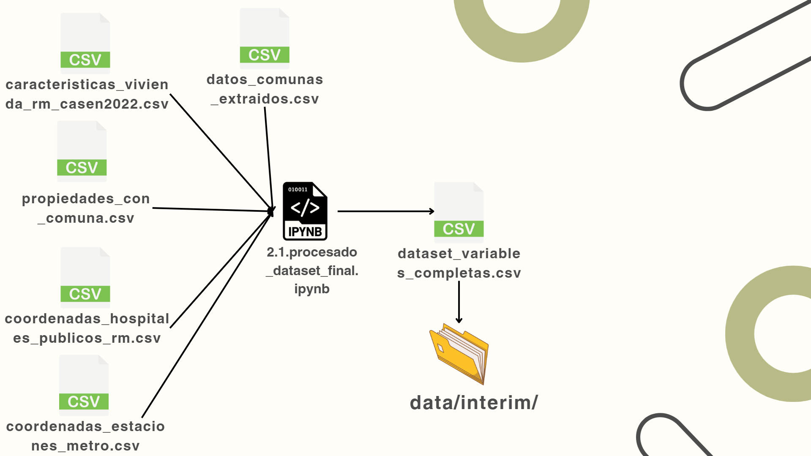

<div align="center">

### 📊 Composición del Dataset Final

| 📋 Componente | Cantidad |
|:--------------|:--------:|
| 🕷️ Variables base (scraping) | 8 |
| 🏛️ Variables comunales (BCN) | 134 |
| 🏠 Variables vivienda (CASEN) | 18 |
| 🗺️ Variables geoespaciales | 3 |
| **📊 TOTAL VARIABLES** | **163** |
| **📝 REGISTROS INICIALES** | **5.943** |
| **📍 COBERTURA** | **Región Metropolitana** |

</div>

---

### 🧹 4.5 Limpieza y Preprocesamiento de Datos

Después de tener el dataset completo con todas las variables posibles, se procedió con la **limpieza de datos**, enfocándose específicamente en las variables extraídas mediante web scraping, ya que son las más propensas a contener valores atípicos o inconsistentes.

#### 🎯 Criterios de Filtrado

Se aplicaron los siguientes filtros para garantizar la calidad y coherencia de los datos:

<table>
<tr>
<td width="50%">

**❌ Valores Eliminados:**
- 💰 Precio ≤ $30.000.000 CLP
- 💰 Precio ≥ $900.000.000 CLP
- 📏 Superficie total ≤ 60 m²
- 📏 Superficie total ≥ 1,000 m²
- 🏗️ Superficie construida ≤ 40 m²
- 🏗️ Superficie construida ≥ 1,000 m²
- 🛏️ Dormitorios < 1
- 🚿 Baños ≤ 0
- 🚿 Baños ≥ 10
- 🔄 Registros duplicados
- ∅ Valores nulos

</td>
<td width="50%">

**✅ Rangos Válidos Aplicados:**
- 💰 **Precio:** $30M - $900M CLP
- 📏 **Superficie total:** 60 - 1,000 m²
- 🏗️ **Superficie construida:** 40 - 1,000 m²
- 🛏️ **Dormitorios:** ≥ 1
- 🚿 **Baños:** 1 - 9
- 📍 **Coordenadas:** Válidas en RM

</td>
</tr>
</table>


> **💡 Justificación de los filtros:**
> - **Precio ($30M-$900M):** Las propiedades fuera de este rango tienen características atípicas. Casas bajo $30M pueden tener problemas estructurales o legales, mientras que sobre $900M son mansiones/propiedades de lujo con características no representativas del mercado convencional, y no le estoy dando un enfoque a ese tipo de casas debido a que tienen variables poco equiparables con las de el rango entre $30M - $900M
> - **Superficies (60-1,000 m² total / 40-1,000 m² construida):** Filtran propiedades extremadamente pequeñas (posiblemente errores de datos) o terrenos/propiedades industriales.
> - **Baños (1-9):** Elimina registros sin baños (errores) y casos excepcionales con 10+ baños (propiedades comerciales o datos incorrectos).
> - **Dormitorios (≥1):** Todas las viviendas deben tener al menos un dormitorio.
---

#### 📊 Análisis de Distribuciones: Antes vs Después

**🔴 PROBLEMA: Distribuciones No Identificables**

De hecho, podemos observar cómo **no es posible identificar correctamente** la forma de distribución de variables clave como el precio, superficie total, superficie construida, número de baños y dormitorios debido a la presencia masiva de outliers extremos:

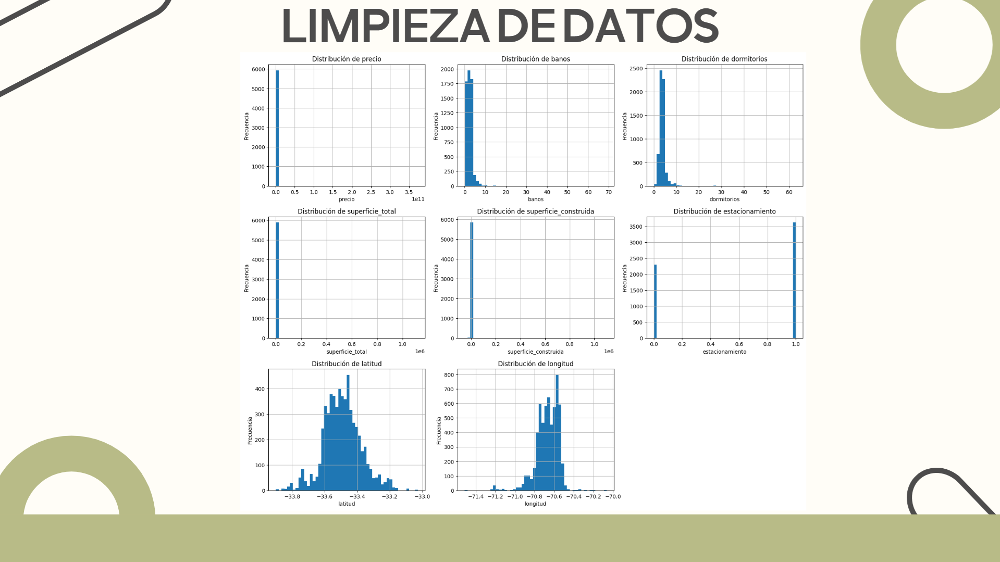

---

**🔄 PROCESO: Aplicación de Limpieza**

Por lo tanto, se aplicó una limpieza exhaustiva de datos en la cual se eliminaron todos los valores mencionados anteriormente, además de registros duplicados y valores nulos:

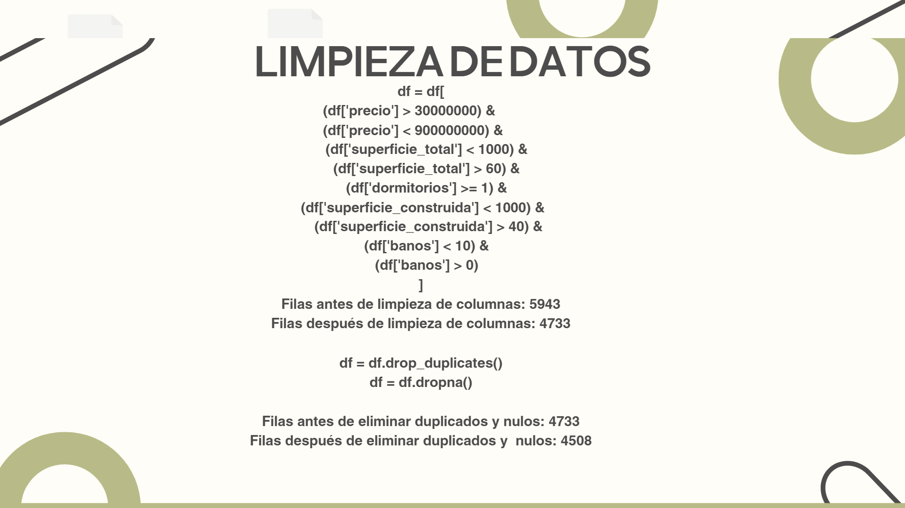

<div align="center">

**Impacto de la limpieza:**

| Métrica | Antes | Después | Cambio |
|:--------|:-----:|:-------:|:------:|
| 📝 Total registros | 5.943 | 4.508 | **-1.435** |
| 📊 Reducción | 100% | 75,8% | **-24,2%** |

*Se eliminaron 1.435 registros con valores atípicos o errores*

</div>

---

**✅ RESULTADO: Distribuciones Claramente Identificables**

Luego de la limpieza, **ahora sí es posible observar de buena manera** la forma de distribución de las variables. Podemos detectar que la mayoría de variables como el precio, superficie total, superficie construida, baños y dormitorios tienen una **distribución sesgada a la izquierda con cola alargada hacia la derecha**:

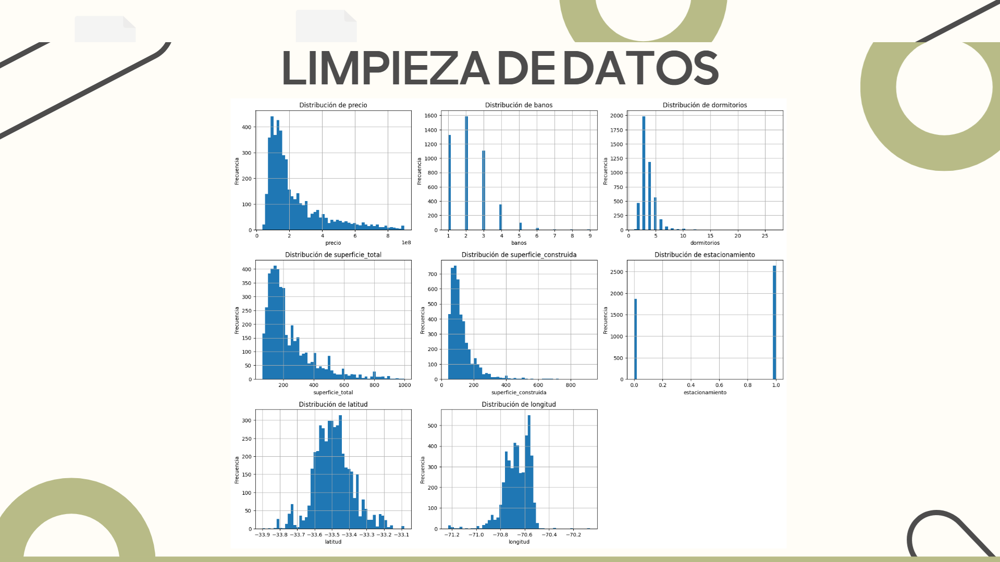

**Mejoras logradas:**
- ✅ **Distribuciones claramente identificables** - Patrones visibles y analizables
- 📊 **Sesgo positivo** - Cola larga a la derecha
- 🎯 **Datos representativos** del segmento objetivo ($30M-$900M)

> La distribución sesgada a la derecha es característica natural de los mercados inmobiliarios, donde la mayoría de propiedades se concentran en rangos medios-bajos de precio, con una cola larga hacia propiedades de mayor valor. Esto refleja la realidad del mercado y **NO debe ser corregido**, ya que es información valiosa para el modelo.

---

### 🔀 4.6 División Train/Test con Estratificación

El dataset limpio se dividió estratégicamente en conjuntos de entrenamiento y prueba para garantizar una evaluación robusta del modelo:

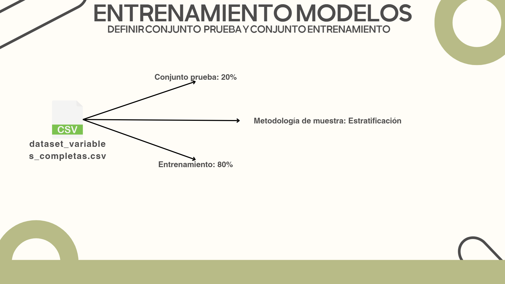

#### 📐 Configuración de la División

<div align="center">

| 📊 Conjunto | Porcentaje | Registros |
|:------------|:----------:|:---------:|
| 🎓 **Entrenamiento** | 80% | 3.606 |
| 🧪 **Prueba** | 20% | 902 |
| 📝 **Total** | 100% | **4,508** |

</div>

**Estrategia aplicada:** El dataset se dividió en un **80% para entrenamiento** y un **20% para prueba**. Se aplicó **estratificación** para asegurar que la distribución de la variable objetivo (precio) sea proporcionalmente idéntica en ambos subconjuntos.

> **🎯 ¿Por qué estratificar?** En datasets con distribuciones asimétricas como este caso en que el precio presenta una distribución sesgada a la izquierda con una larga cola a la derecha, la estratificación es **crucial** para evitar que por azar el conjunto de entrenamiento o prueba queden sobrerrepresentados en viviendas económicas o caras. Esto garantiza que cada split tenga una representación equilibrada de las categorías.

---

### 🤖 4.7 Entrenamiento Preliminar de Modelos

Hay que dejar en claro que no comenzamos con un Análisis Exploratorio de Datos como es lo común debido a que lo que buscamos primeramente es entrenar los modelos y mediante el feature importance, detectar cuáles son las variables que tienen poder predictivo, para luego reducir las variables del dataset de 163 a solo 20, y luego procederemos con el Análisis Exploratorio de Datos y luego entrenar los modelos restantes, es por ello que no vamos a seguir la ruta más “convencional”.
Se entrenaron y compararon **6 algoritmos de Machine Learning** diferentes para identificar los modelos con mejor desempeño predictivo en el conjunto de datos:

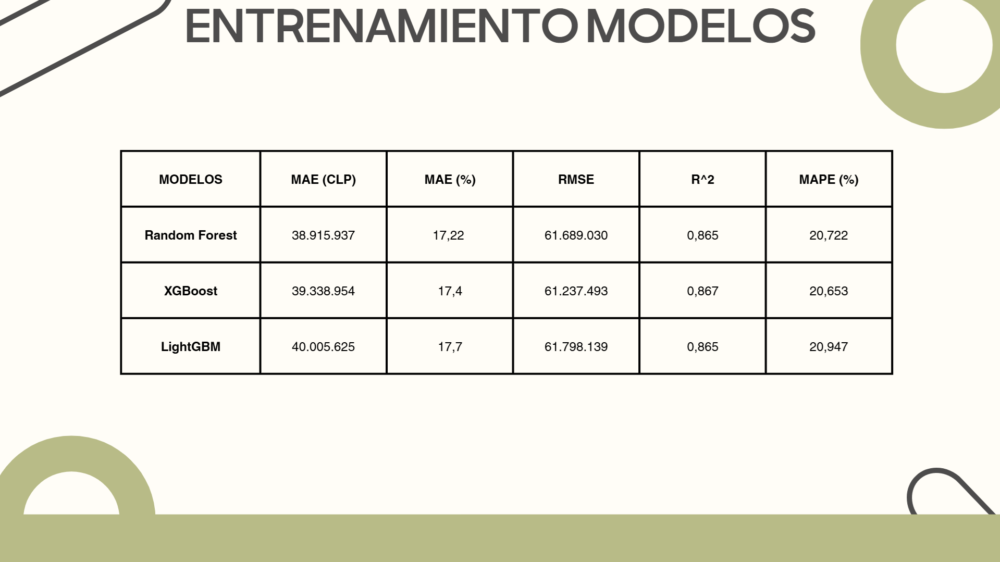

---


### 🎯 4.8 Feature Importance: Identificación de Variables Clave

Para optimizar el modelo y mejorar la interpretabilidad, se realizó un **análisis de importancia de variables** en los tres mejores modelos, identificando cuáles características tienen mayor impacto en la predicción de precios, se normalizaron los 3 modelos para igualar su peso, se calculó un promedio por variable y se seleccionaron las 20 variables más importantes en el promedio de los 3 modelos.


#### 🏆 Top 5 Variables Más Importantes (Promedio Ponderado)

<div align="center">

| Ranking | Variable | Promedio | Random Forest | XGBoost | LightGBM | Categoría |
|:-------:|----------|:--------:|:-------------:|:-------:|:--------:|:---------:|
| 🥇 | **Matrícula Particular Pagado** | 0,2072 | 0,2020 | 0,3888 | 0,0309 | 📚 Educación |
| 🥈 | **Superficie Total** | 0,1475 | 0,2265 | 0,0247 | 0,1914 | 📏 Física |
| 🥉 | **SIMCE 4to Básico Lectura** | 0,1206 | 0,1900 | 0,1588 | 0,0128 | 📚 Educación |
| 4️⃣ | **Superficie Construida** | 0,0671 | 0,0721 | 0,0150 | 0,1144 | 🏗️ Física |
| 5️⃣ | **Baños** | 0,0580 | 0,0577 | 0,0159 | 0,1004 | 🚿 Física |

</div>

**Hallazgos destacados:**

🎓 **Variables educacionales dominan** - La matrícula en colegios particulares y el rendimiento SIMCE son los predictores más fuertes, reflejando que la calidad educacional del sector es un proxy del nivel socioeconómico

📏 **Características físicas son fundamentales** - Superficie total y construida son altamente predictivas, como era esperado

🤔 **Diferencias entre modelos** - XGBoost da mucho peso a matrícula particular (0.3888), mientras Random Forest prefiere superficie total (0.2265)

---

#### 📊 Top 20 Variables Seleccionadas

Las 20 variables con mayor importancia ponderada fueron seleccionadas para el modelo final. No se incluyeron más variables ya que **la ganancia predictiva adicional es residual**.

<details>
<summary>📋 <b>Ver listado completo de las 20 variables seleccionadas</b></summary>

1. 🎓 **Matrícula particular pagado 2024**
2. 📏 **Superficie total**
3. 📚 **SIMCE 4to básico lectura 2022**
4. 🏗️ **Superficie construida**
5. 🚿 **Baños**
6. 🗺️ **Longitud**
7. 📊 **SIMCE 4to básico matemáticas 2022**
8. 🚇 **Distancia metro**
9. 📍 **Latitud**
10. 🏥 **Distancia hospital**
11. 💰 **Ingreso promedio**
12. 🛏️ **Dormitorios**
13. 🌍 **Extranjeros 2025 (%)**
14. 📉 **Pobreza multidimensional 2022 (%)**
15. 💵 **Pobreza por ingresos 2022 (%)**
16. 🏚️ **Hogares hacinados 2025 (%)**
17. 💼 **Trabajadores información y comunicación**
18. 🏦 **Trabajadores financieras y seguros**
19. 🎓 **Matrícula subvencionada 2024**
20. 🏢 **Empresas otras actividades 2023**

</details>

---

#### 🎯 Categorización de Variables Seleccionadas

<div align="center">

| Categoría | Cantidad | Ejemplos |
|:----------|:--------:|----------|
| 📏 **Características Físicas** | 5 | Superficie total/construida, baños, dormitorios |
| 📍 **Ubicación Geoespacial** | 4 | Latitud, longitud, distancia metro/hospital |
| 🎓 **Educación** | 4 | Matrícula particular/subvencionada, SIMCE lectura/matemáticas |
| 💰 **Socioeconómico** | 4 | Ingreso promedio, pobreza, hacinamiento, extranjeros |
| 💼 **Actividad Económica** | 3 | Trabajadores sector financiero/comunicaciones, empresas |

</div>

>  El modelo confirma que el **precio de una vivienda no solo depende de sus características físicas**, sino que está fuertemente influenciado por el **contexto socioeconómico y educacional** del sector. Las comunas con mejores colegios particulares, mayor rendimiento SIMCE e ingresos más altos tienen precios significativamente más elevados, independientemente del tamaño de la propiedad.

---

### 🔬 4.10 Eliminación de Multicolinealidad mediante Análisis de Correlación de Pearson

Tras aplicar Feature Importance y seleccionar las 20 variables más predictivas, se van a entrenar las redes neuronales utilizando tres diferentes de datasets:

1. **Dataset completo**: Todas las variables originales (+160 features)
2. **Dataset Feature Importance**: Las 20 variables seleccionadas por Feature Importance
3. **Dataset reducido**: Las variables del Feature Importance, eliminando aquellas con alta correlación entre sí

Luego tras aplicar feature importance y seleccionar las 20 variables más predictivas, se van a usar 3 tipos de dataframes para entrenar las redes neuronales, esto para comprobar el impacto de entrenar las redes neuronales con las +160 variables, con 20 variables obtenidas del feature importance, y otro con las variables del feature importance, pero eliminando las variables que presenten alta correlación entre sí, para eliminar multicolinealidad, el criterio usado será eliminar toda variable con un coeficiente de Pearson mayor a 0,8.

Aquí está la matriz de correlación sin haber eliminado aún las variables con alta correlación entre sí, como se puede ver hay varias variables con coeficiente de Pearson mayor a 0,8.


Luego de la limpieza en relación al coeficiente de Pearson nos quedamos con 12 variables independientes y la variable dependiente precio, esto para luego entrenar 3 datasets distintos en la red neuronal, uno con las 160+ variables, otro con las 20 variables obtenidas del feature importance y la última que está hecha con base en las 20 variables del feature importance pero eliminando la multicolinealidad.


Esto nos permitira más adelante poder ver que tanto afecta al rendimiento de una red neuronal por ejemplo la presencia de multicolinealidad, como también que tanto afecta el hecho de usar más de 160 variables vs usar solo las variables obtenidas del feature importance.

---

## 🎯 5. Análisis Exploratorio de Datos

Tras la selección de las 20 variables más relevantes mediante feature importance, se procede con un análisis exploratorio detallado. Este enfoque es más eficiente que analizar las +160 variables iniciales, permitiendo concentrar el análisis en las características verdaderamente predictivas del precio de vivienda.

### 📊 Distribución General de Variables

El panorama inicial de las 20 variables seleccionadas revela patrones diversos:
- Múltiples distribuciones con sesgo izquierdo
- Presencia de distribuciones bimodales
- Pocas distribuciones normales

Esta diversidad sugiere la necesidad de transformaciones específicas según el modelo de ML a utilizar.


---

### 💰 Variable Objetivo: Precio de Vivienda

La distribución del precio presenta un **marcado sesgo hacia viviendas de menor costo**, con una cola larga que se extiende hacia los rangos de $300M y $900M.

**Implicaciones para el modelado:**
- Se requerirá transformación logarítmica para modelos como SVM y Regresión Lineal
- Esta transformación ayudará a normalizar la distribución y mejorar el desempeño del modelo

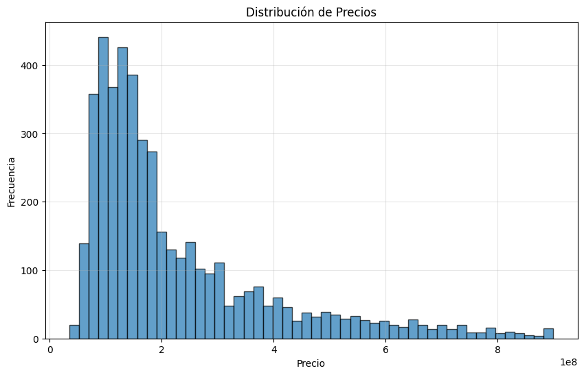

---

### 🏫 Características Educacionales

#### Matrícula por Tipo de Establecimiento

Las distribuciones de colegios particulares pagados y subvencionados muestran comportamientos distintos:

- **Subvencionados**: Distribución bimodal claramente definida
- **Particulares pagados**: Alta concentración de matrículas en el rango de 3,000-6,000 estudiantes

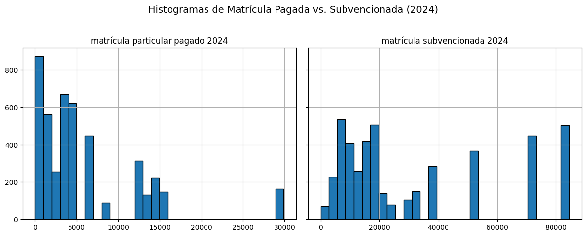

#### Puntajes SIMCE

Tanto en Lenguaje como en Matemáticas se observan **distribuciones bimodales**:

- **Matemáticas**: Las modas se separan en torno a 275 puntos, con un pico notable cerca de 270 (frecuencia >800)
- **Lenguaje**: Separación de modas alrededor de 285 puntos

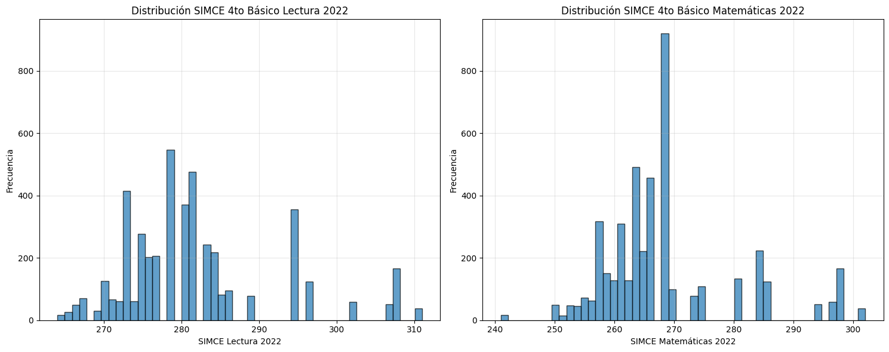

---

### 🔍 Análisis de Relaciones: Scatterplots

Los gráficos de dispersión revelan correlaciones importantes con el precio y posibles problemas de **heteroscedasticidad** en:
- Superficie total
- Superficie construida  
- Latitud (en menor medida)

**Solución propuesta**: Aplicar transformación logarítmica para estabilizar la varianza.


---

### 📈 Matriz de Correlación

La matriz de correlación cuantifica la fuerza de las relaciones lineales entre variables en una escala de 0 a 1, revelando tanto las variables más predictivas del precio como problemas potenciales de multicolinealidad que deben abordarse.


#### 🎯 Correlaciones Fuertes con el Precio

Las variables con mayor poder predictivo sobre el precio de vivienda son:

| Variable | Correlación | Interpretación |
|----------|-------------|----------------|
| **Superficie Total** | 0.70 | Relación directa muy fuerte |
| **SIMCE 4° Básico Lectura** | 0.68 | Indicador socioeconómico del sector |
| **SIMCE 4° Básico Matemáticas** | 0.67 | Indicador socioeconómico del sector |
| **Ingreso Promedio** | 0.66 | Poder adquisitivo de la zona |
| **Matrícula Particulares Pagados** | 0.64 | Refleja nivel socioeconómico del área |

#### ⚠️ Multicolinealidad Detectada

Se identificaron **tres grupos principales de variables altamente correlacionadas** entre sí y es que estas correlaciones nos permiten identificar


Variables correlacionadas con **SIMCE 4° Básico Lectura** (0.68 con precio):
- **Matrícula particulares pagados**: r = 0.88
- **Ingreso promedio**: r = 0.86
- **SIMCE 4° Básico Matemáticas**: r = 0.97


Variables correlacionadas con **Empresas Financieras y Seguros** (0.47 con precio):
- **Empresas otras actividades 2023**: r = 0.78
- **Trabajadores información y comunicaciones 2023**: r = 0.91
- **Trabajadores otras actividades 2023**: r = 0.80


Variables correlacionadas con **Pobreza por Ingresos** (-0.53 con precio):
- **SIMCE 4° Básico Lectura**: r = -0.74
- **Ingreso promedio**: r = -0.79
- **SIMCE 4° Básico Matemáticas**: r = -0.66


---

### 🗺️ Distribución Geográfica de Precios

El mapa de calor espacial revela patrones geográficos claros:

| Zona | Característica de Precios |
|------|---------------------------|
| **Sur** | Concentración de viviendas de menor valor |
| **Noreste** | Mayor concentración de propiedades de alto valor |
| **Noroeste** | Presencia moderada de viviendas de mayor valor |

**Zona de transición**: Entre las latitudes -33.3 y -33.2 se observa un incremento notable en los precios.

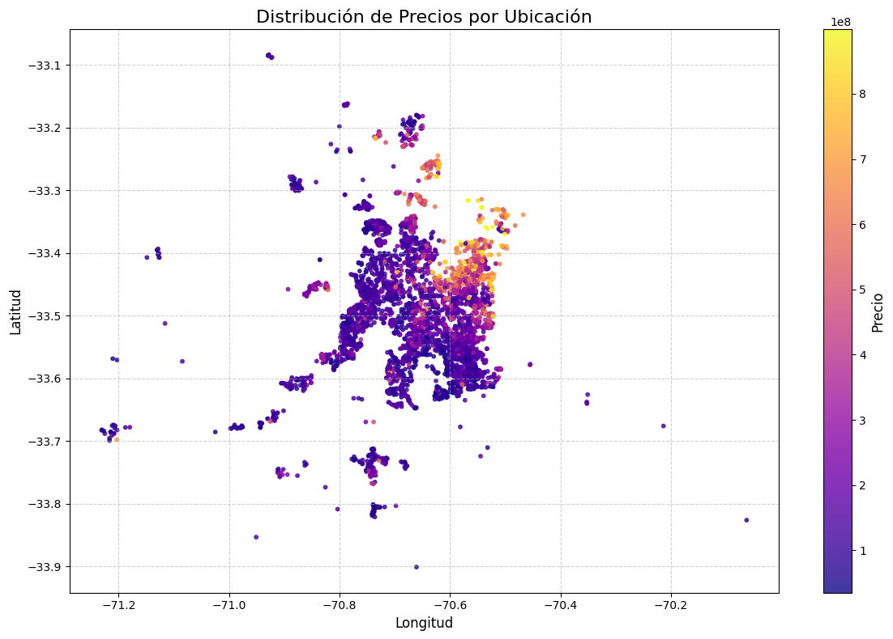

---

## 6.💡 Entrenamiento 

### 🔍 6.1 Entrenamiento MLP

Como antes habíamos explicado, se van a entrenar 3 redes neuronales con la misma arquitectura (MLP), la diferencias eran sus parámetros y los datos los cuales van a alimentar cada red neuronal, por ejemplo se entrenara una MLP con todas las variables sin ningún filtro, en este caso son un total de 163 variables, otra MLP se entrenara con 20 variables, filtrando basándonos en el feature importance previamente realizado en xgb, lgbm y rf, por último se entrenó una MLP eliminando la multicolinealidad de las 20 variables anteriores obtenidas del feature importance, ya había hablado de esto antes pero lo reitero.

Podemos ver que el rendimiento aumenta en los dos casos, cuando se usan 20 variables como también cuando se usan 12 variables eliminando multicolinealidad, el aumento del rendimiento es claro en estos casos por lo que podemos darnos cuenta de que aunque las redes neuronales manejan bien múltiples variables, y maneja bien la multicolinealidad, estas dos afectan al rendimiento de la misma.

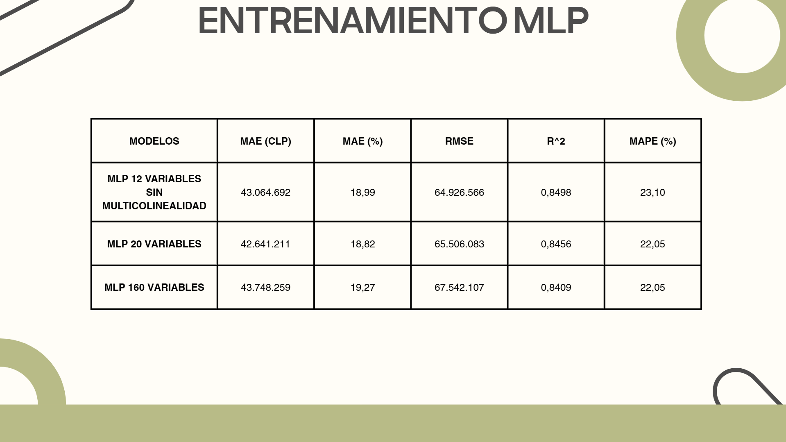

---

### 🔍 6.2 Entrenamiento RF XGB LGBM

Vamos a volver a ver a recapitular los resultados de los modelos basados en árboles de decisión, y podemos apreciar como en general los 3 modelos tienen rendimiento similar, sin que ninguno destaque sobre otro. Lo de mayor utilidad con base en estos 3 modelos fue el feature importance, ya que fue la base para probar distintas formas de entrenar las MLP anteriores.


---

### 🔍 6.3 Entrenamiento RL SVM

Por otro lado, el rendimiento de la regresión lineal y las máquinas de soporte vectorial son notoriamente peores que los modelos de árboles de decisión o las MLP. Con mayores errores y menor explicatividad. Por otro lado, se usó el logaritmo natural del precio para aumentar el rendimiento del R2 para normalizar la variable a predecir, ya que al no tener normalizada la variable a predecir en regresión lineal o máquinas de soporte vectoriales se ve muy mermado el R2 en los 2 modelos.

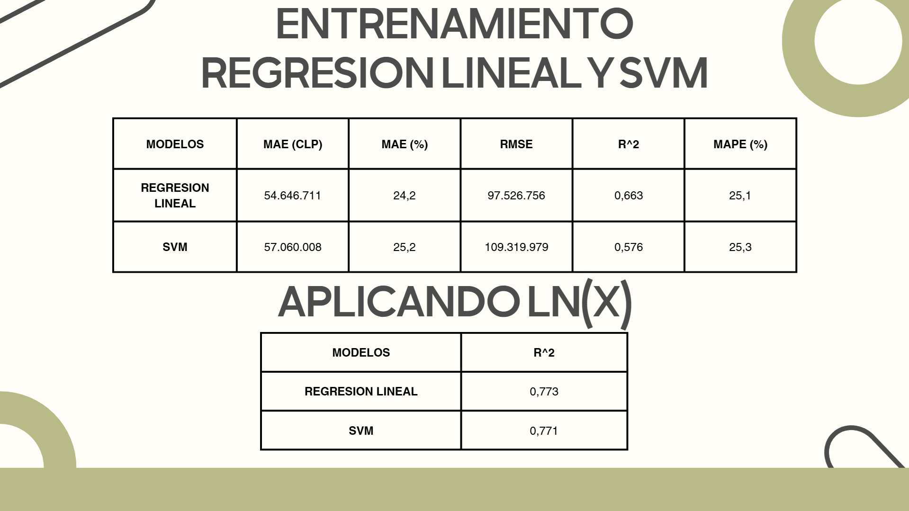

---

## 7.💡 Validación Cruzada y Optimización de hiperparametros

### 🔍 7.1 Validación Cruzada y Análisis de Robustez

Para identificar cualquier problema en el entrenamiento o posible sobre ajuste del modelo, se aplicó **validación cruzada por K-Fold (K-Fold = 5)**, evaluando la consistencia del rendimiento en diferentes particiones de los datos. Pero también la validación cuzada nos ayuda a ver cual es el verdadero rendimiento del modelo, ya que puede ocurrir que tenga diferencias entre el rendimiento del test y el rendimiento en un ambiente real y datos nuevos.

Como se puede ver la validación cruzada fue aplicada teniendo como valor objetivo el coeficiente de determinación, y podemos ver que en general el promedio comparando los modelos basados en árboles de decisión y el MLP son bastante similares, con una ligera ventaja por parte de los modelos basados en árboles de decisión.

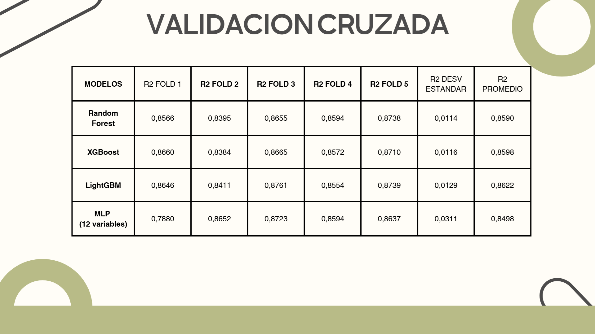

#### 🔬 Análisis de Validación Cruzada

**Observaciones clave:**
✅ **Rendimiento consistente** - Los tres modelos muestran R² relativamente similar en todos los folds (≈0.86)

✅ **Baja variabilidad** - Desviación estándar < 0.013 indica estabilidad en las predicciones

🏆 **LightGBM lidera marginalmente** - R² promedio de 0.8622, aunque la mejora es prácticamente marginal

📊 **No hay evidencia de overfitting** - La consistencia entre folds descarta sobreajuste en todos los modelos

📊**Los modelos basados en árboles de decisión lideran ligeramente** - RF, XGB y LGBM son ligeramente más competentes que las redes neuronales, pero se benefician mutuamente a la hora de entrenarlos de forma paralela.

> **💡 Interpretación:** Tres modelos se basan en **árboles de decisiones (RF, XGB, LGBM)**, lo que explica su rendimiento similar. Sus diferencias se manifiestan principalmente en, ⚡velocidad de cómputo, 🎯capacidad predictiva, 🔍interpretabilidad o 💻eficiencia de memoria, pero estas diferencias se ven reflejadas en conjuntos de datos más grandes y extensos, con incluso más variables que las estudiadas aquí. Ademas de que los modelos de arboles de decision en una medida no muy grande mejores en rendimiento que las redes neuronales MLP.
> No se aplico cross validation a LR y SVM debido a que estos por la naturaleza de los modelos no se sobreajustan

### 🔍 7.1 Optimización de Hiperparametros

**Optimización Hiperparametros random forest**

Podemos notar una mejora sustancial, principalemente del MAE y MAPE al optimizar hiperparametros en random forest

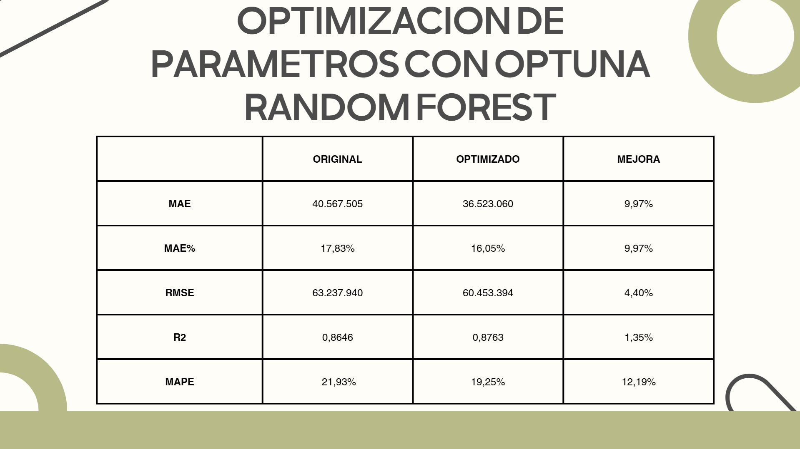

---


<div align="center">

## 🚧 Proyecto en Desarrollo Activo


**Este proyecto está en constante evolución. Las secciones de optimización final y resultados se completarán próximamente.**

---

---
